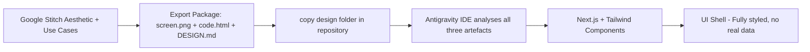
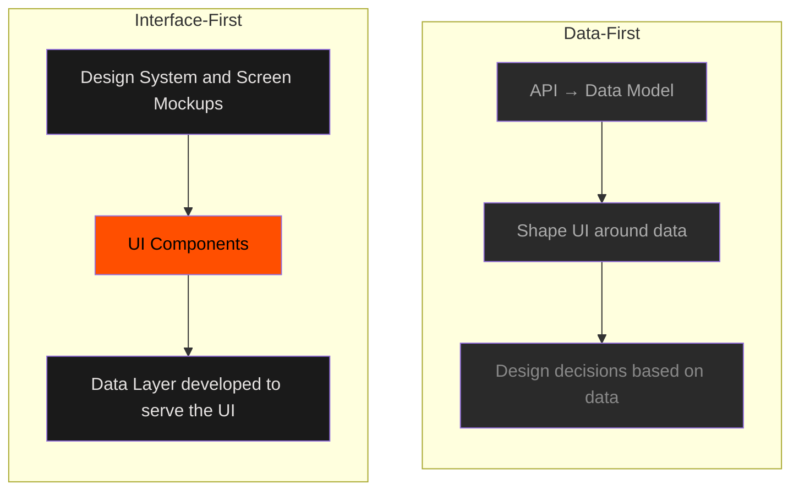
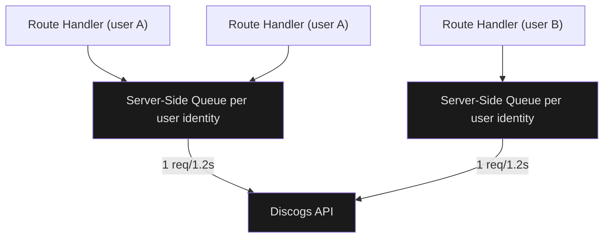
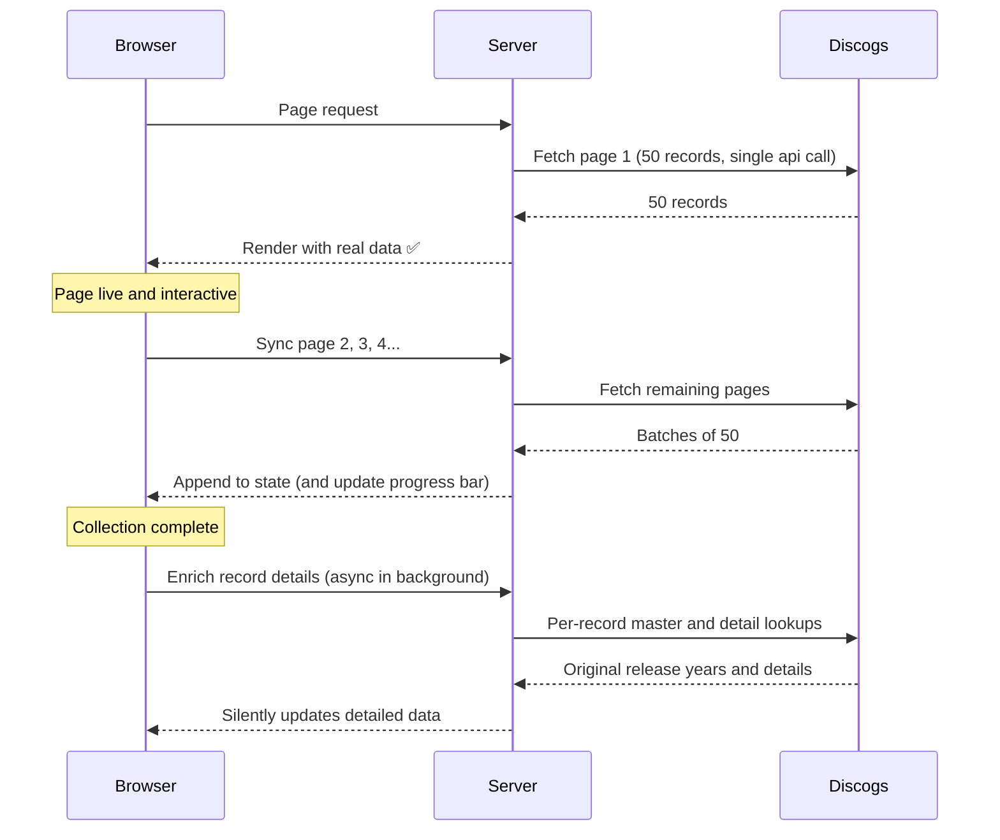
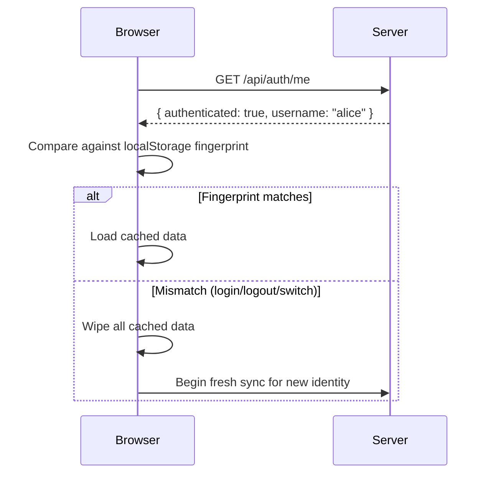
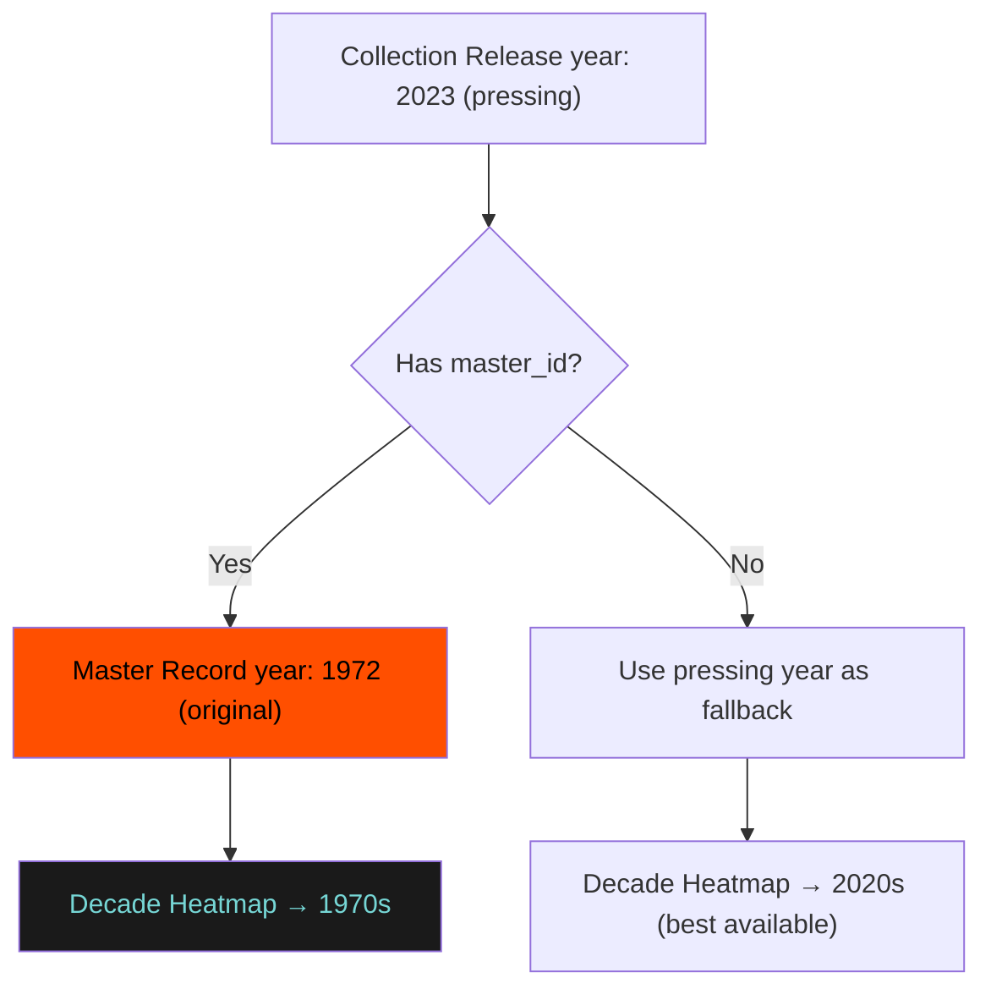
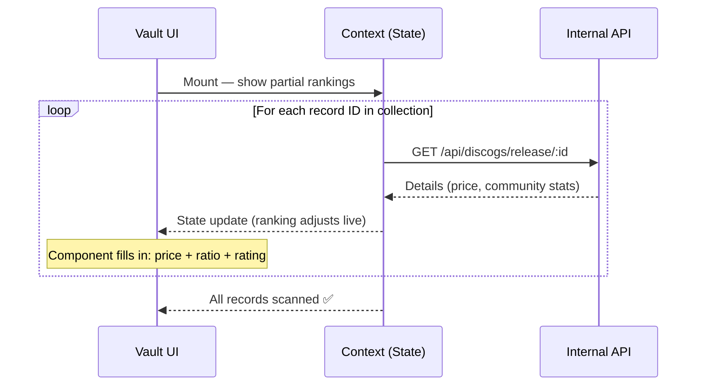
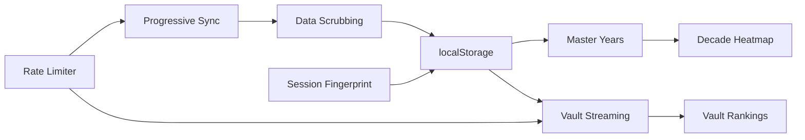

# Building Vinyl Pulse: Interface-Driven Development and Six Hard API Problems

> Designing the UI before writing a single line of backend code: using Google Stitch and the Antigravity IDE

---

## Part 1: Design-First Approach

### Usually I build data-first

The conventional build sequence is to wire up the API, get data flowing, then figure out how to display it. The result is an interface shaped by the data model.

Vinyl Pulse was built the other way around. **The interface comes first. The data is injected into it afterwards.** This approach called interface-driven development changes which decisions happen early and which ones are deferred.

---

### Step 1 — Define the Aesthetic in Google Stitch

Before any code was written, I used [Google Stitch](https://stitch.google.com) to define the product's visual language and generate screen mockups for each use case. Stitch is a generative UI tool: you describe an aesthetic, iterate on screens rapidly, and export a complete design package all without writing a single line of code.

The creative brief was specific: a **"Modern Analog"** aesthetic, inspired by the tactile ritual of handling vinyl. Not a typical data dashboard. Something closer to a premium editorial magazine that happens to be interactive.

The design guidelines that emerged was concrete and opinionated. A few rules from the exported spec:

> *"Standard 1px borders are strictly prohibited. Boundaries between sections must be defined solely through tonal shifts."*

> *"Don't use pure white. Always use `on_surface` (#E5E2E1) to maintain the 'Paper Off-White' warmth."*

> *"Don't use rounded corners larger than `lg` for main containers. The aesthetic is architectural and crisp, not bubbly."*

Six screens were designed this way, each covering a distinct use case:

| Screen | Purpose |
|--------|---------|
| `record_collection` | Main collection overview |
| `decade_heatmap` | Decade distribution visualization |
| `genre_sunburst` | Genre & style breakdown drill-down |
| `vault` | Vault / deep record analytics |
| `wrapped_card` | Individual record detail overlay |

Each exported screen folder contained three artefacts: a **`screen.png`** (rendered mockup), a **`code.html`** (self-contained static implementation), and where applicable a **`DESIGN.md`** (the full design system specification with colour tokens, typography rules, and component guidelines).

---

### Step 2 — Import Into the IDE and Generate Real Components

The Stitch exports were committed directly to the repository under `design/stitch/`. The Antigravity IDE was then given these assets as context and asked to produce production-quality **Next.js + Tailwind components** that matched the aesthetic.

This is no longer random design prompting as it is handing over a specified brief. The IDE can read the exact colour values, typography rules, and component constraints from `DESIGN.md`, reference the `screen.png` to verify visual intent, and use the `code.html` as a structural baseline to cross-reference against.

The result: a fully navigable application with all pages, layouts, navigation, and visual components in place before a single Discogs API call exists.

---

### Step 3 — Inject the Data

With the UI shell complete, the Discogs integration was built as a separate concern and plugged into the existing component contracts.

This is where the design-first approach pays its dividend. Because every component was designed before the data existed, each one had already resolved its own edge cases: what does it look like when data hasn't loaded yet? What does it show when a value is missing? These weren't afterthoughts, they were solved in Stitch design documents, before the first API call was written.

A component like `Vault` was already rendering album art placeholders, rank indicators, and stat slots. Wiring it to live data meant passing real props into an interface that already knew how to handle them including the `undefined` state before data arrives.

---

### Why This Order Matters

Starting from the interface **front-loads design decisions**. By the time the API integration begins, there are no open questions about layout, typography, colour, or interaction model. Those have been resolved in Stitch before a single line of React was written.

The tradeoff is that you need a sufficiently detailed design spec for this to work. Vague mockups produce vague components. The Stitch-generated `DESIGN.md` with explicit prohibitions, named colour tokens, and typographic hierarchy rules was precise enough to build from directly. The Gemini AI in Google Stitch knows the process and pitfalls, so it produces a solid foundation.

---

## Part 2: Problems in the API Integration

Once the UI is in place, the Discogs integration introduces a set of genuine architectural challenges. The API is powerful but heavily **rate-limited**, the data model has some non-obvious inconsistencies, and building a multi-user experience on top of it requires careful thinking about caching, identity, and progressive loading.

---

### 1. Server-Side Rate Limiting Across Concurrent Requests

Discogs enforces ~60 requests per minute per user in a sliding window. The naive assumption is that you can manage this with client-side delays but in a Next.js app, multiple concurrent route handlers can each independently fire API calls, completely unaware of each other.

The architectural solution is a **module-level, per-user request queue** running on the server. All Discogs API calls funnel through a single queue per user identity, which drains at a safe 1.2-second cadence regardless of how many concurrent route handlers are active. Module-level state in Node.js persists across requests within the same process, making this pattern both simple and effective.

> **Note** This pattern works on a single server or standard (in this case Vercel) deployment. If you scale to multiple instances with no shared memory, you will need a centralised queue backed by Redis or equivalent.

---

### 2. Progressive Collection Loading without blocking the UI

A large Discogs collection cannot be fetched in one server-side call, as it would time out. But showing a spinner until everything loads is equally unacceptable. The solution is a **three-phase pipeline** that delivers usable data immediately and enriches it in the background.

Phase 3 runs as a completely silent fire-and-forget process. The user browses normally while original release years etc are resolved in the background.

---

### 3. The `localStorage` Quota

To avoid hitting the back-end with hundreds of requests for each page refresh, we **cache the data locally**. Xaching raw API responses for offline-speed page refreshes is straightforward until a large collection silently starts throwing `QuotaExceededError` as the browser's 5MB storage limit is hit.

The architectural fix has two parts:

**Scrub at the source.** Rather than caching the full API response (15 to 50KB per record, including tracklists, credits, and image arrays), extract only the fields the UI actually needs before committing anything to storage. The difference is roughly 100 bytes vs 50KB per record, three orders of magnitude.

**Partition into separate keys.** Each data type (collection, vault metadata, master years, price details) lives in its own storage key. This allows partial recovery — if vault metadata overflows, the core collection remains intact.

---

### 4. OAuth Session Transitions With Stale Client Cache

The app runs in two modes simultaneously: a guest/demo mode (Personal Access Token, default collection) and a logged-in mode (OAuth, personal collection). The hard problem: when a user authenticates after browsing as a guest, the client-side cache contains the wrong user's data.

The solution is a **session fingerprint check on every mount**. The client calls a `/api/auth/me` endpoint to get the server's authoritative identity, compares it against a stored username fingerprint in `localStorage`, and wipes all cached data if there is any mismatch.

OAuth tokens themselves are stored exclusively in **HTTP-only cookies** inaccessible to browser JavaScript. The `/api/auth/me` endpoint is the only channel through which the client can discover the authenticated identity, ensuring tokens are never exposed to client-side code.

---

### 5. Pressing Year vs. Original Release Year

The Discogs collection API returns a `year` field on each release, but this is the **pressing year**, not the year the music was originally created. A 2023 reissue of a 1972 classic reads as a 2020s decade record. For a Decade Heatmap, this produces entirely wrong distributions.

Discogs solves this at the data level through **Master Releases**: canonical entries that group all pressings of the same recording and carry the original release year. Each collection item links to its master via `master_id`.

Master records are cached at the server level for 30 days. Original release years are immutable facts that never need to be re-fetched. The enrichment runs in the background (phase 3 of the sync pipeline) with no UI impact.

---

### 6. One Request Per Record, No Batching — Streaming the Results

The Vault page ranks the collection by market value: highest-priced records first, with community want/have ratios and current marketplace prices. All of this requires hitting `/releases/{id}`, one call per record, no batch endpoint available.

For 300 records at 1.2 seconds each (enforced by the rate limiter queue), this is a six-minute operation. The architectural response is to treat this as a **streaming problem**.

Each result is written to shared React context state the moment it arrives. Components that depend on that state re-render automatically so the Vault ranking is live and self-correcting throughout the scan. Records render as complete usable cards from the start, with stat slots populating as each fetch resolves.

A subtle **Archive Integrity Meter** a progress bar embedded in the page header with a shimmer animation while active communicates the scan progress without blocking interaction. A floating toast mirrors this for users who have scrolled past the header. On return visits, the per-record skip guard means already-cached records are counted but not re-fetched, completing the scan in seconds.

---

## The Thread Connecting All Six

These six problems don't exist in isolation. The **rate limiter** controls the cadence of the vault scan. The **vault scan** fires one-per-record because there is no batch endpoint. Each result **streams into shared state**, immediately updating the UI. The **session fingerprint** ensures the cache belongs to the right user. The **data scrubbing** from problem 3 is what makes caching hundreds of per-record responses feasible in the browser at all. And the **master year enrichment** from problem 5 runs on the same pipeline and rate limiter as the vault scan.

The biggest takeaway when building on top of a rate-limited consumer API: **design for the latency of the data, not the latency of the network.** The HTTP round-trip is fast. Building a complete, enriched, correctly attributed picture of a large collection takes minutes of quiet background work. The craft is in making that feel invisible.

---

*Vinyl Pulse source code: [github.com/bavobbr/discogs-insights](https://github.com/bavobbr/discogs-insights)*
